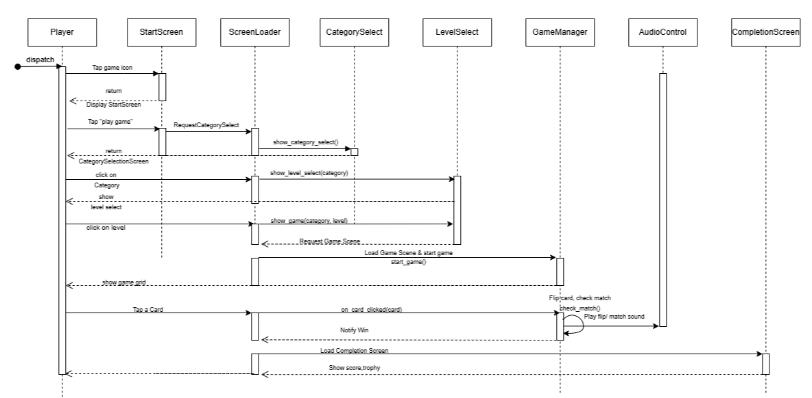

Architecture Documentation

Project: FunFlip Game

Authors:

Ashish Ghaskata\
Krishna Raj Bhandari

Suraj Bhatta

Mohammad Adnan Khan

**Documentname:** AB-Funflip Game-Architecture Doc

**Version:** 1.0

**Creation date:** 20.06.2025

**File:** \<file location\>

# Table of Contents {#table-of-contents .TOC-Heading .unnumbered}

[Table of Figure [1](#table-of-figure)](#table-of-figure)

[2.1 Description of System Architecture
[2](#description-of-system-architecture)](#description-of-system-architecture)

[2.1.1 Functional Requirements and Non Functional Requirements
[2](#functional-requirements-and-non-functional-requirements)](#functional-requirements-and-non-functional-requirements)

[1. List of Requirements [2](#_Toc201629465)](#_Toc201629465)

[2.1.2 Prioritization of Non-Functional Requirements
[3](#prioritization-of-non-functional-requirements)](#prioritization-of-non-functional-requirements)

[2.1.3 Architectural Principles
[4](#architectural-principles)](#architectural-principles)

[2.1.4 Interfaces [4](#interfaces)](#interfaces)

[2.1.5 Big picture of the system Architecture
[6](#big-picture-of-the-system-architecture)](#big-picture-of-the-system-architecture)

[2.2 System Design [8](#system-design)](#system-design)

[2.2.1 System decomposition
[8](#system-decomposition)](#system-decomposition)

[2.2.2 Design Decisions [8](#design-decisions)](#design-decisions)

[2.2.3 Design Alternatives Considered.
[9](#design-alternatives-considered.)](#design-alternatives-considered.)

[2.2.4 Documented Reuse of Components in FunFlips
[9](#documented-reuse-of-components-in-funflips)](#documented-reuse-of-components-in-funflips)

[Activity Diagram [10](#activity-diagram)](#activity-diagram)

[2.3 Human Machine interface
[12](#human-machine-interface)](#human-machine-interface)

[2.3.1 Requirements for the H-M Interface
[12](#requirements-for-the-h-m-interface)](#requirements-for-the-h-m-interface)

[2.3.2 Design Principles and Style Guide
[12](#design-principles-and-style-guide)](#design-principles-and-style-guide)

[2.3.3 Interaction Modeling
[12](#interaction-modeling)](#interaction-modeling)

# Table of Figure {#table-of-figure .unnumbered}

[Figure 1 High Level System Architecture
[6](#_Toc201629396)](#_Toc201629396)

[Figure 2 Activity Diagram [9](#_Toc201629397)](#_Toc201629397)

[Figure 3 Domain Data Model [10](#_Toc201629398)](#_Toc201629398)

[Figure 4 Interaction Modelling [12](#_Toc201629399)](#_Toc201629399)

# 2.1 Description of System Architecture {#description-of-system-architecture .unnumbered}

## 2.1.1 Functional Requirements and Non-Functional Requirements {#functional-requirements-and-non-functional-requirements .unnumbered}

[]{#_Toc201629465 .anchor}1. List of Requirements

Below are the identified functional and non-functional requirements for
the FunFlip educational game. Each requirement is categorized and marked
as \'Must\' or \'Can\' based on priority.

  ---------------------------------------------------------------------------------
  **Requirement**                                     **Must/Can**   **Category**
  --------------------------------------------------- -------------- --------------
  Game must allow category selection (Animals,        Must           FR, UX
  Fruits, Vegetables)                                                

  Game must support 3 difficulty levels (Easy,        Must           FR
  Medium, Hard)                                                      

  Players must be able to flip cards to find matching Must           FR
  pairs                                                              

  Audio must play when a card is flipped              Must           FR, UX, Q

  Unmatched cards must flip back after a delay        Must           FR

  Game must display turn count                        Must           FR

  Happy sound must play when match is successful      Must           FR, UX

  Players must see options to replay, return to menu, Must           FR, UX
  or quit                                                            

  Voice feedback must differ by category (e.g.,       Can            FR, Q
  animal sounds)                                                     

  The UI must be simple and colourful for ages 4--6   Must           NFR, UX, Q

  The game must run offline                           Must           NFR, L

  Sound/music must be toggleable in options           Can            FR, UX

  Game must respond within 0.5 seconds after user     Must           NFR, Q
  actions                                                            

  Game must not collect personal data                 Must           NFR, L

  Each component must be modular in Godot             Can            T, NFR
  ---------------------------------------------------------------------------------

## 2.1.2 Prioritization of Non-Functional Requirements {#prioritization-of-non-functional-requirements .unnumbered}

The top 3 quality attributes identified for FunFlip are Usability,
Accessibility, and Performance. The following table describes how each
attribute is defined, implemented, and measured.

Top 3 Quality Attributes

1.  Usability

2.  Accessibility

3.  Performance

 

Operationalization of Quality Characteristics

  ----------------------------------------------------------------------------
  Quality         Objective             How to Achieve It Measurement Criteria
  Attribute       (Definition)                            
  --------------- --------------------- ----------------- --------------------
  Usability       The game must be      Use large         Can reach game
                  simple and navigable  buttons, few      within 3 clicks; no
                  by children aged 4--6 navigation steps  text reading needed

  Accessibility   The game must provide Use audio cues    100% of cards play
                  voice feedback and    when flipping or  sound; mute option
                  sounds to aid         matching cards    available
                  learning                                

  Performance     The game must feel    Optimize Godot    Card flip response ≤
                  responsive to user    scenes and        0.5s; zero crashes
                  actions               animation speed   during tests
  ----------------------------------------------------------------------------

 

## 2.1.3 Architectural Principles {#architectural-principles .unnumbered}

These are the general rules we followed in designing Fun Flips:

**1️. Strict Layered Architecture**\
The system is divided into clear layers (UI → Scene Loader → Game Logic
→ Data → Services). Each layer talks only to the one below.

**2. Separation of Concerns & Single Responsibility**\
Each part does just one job: Scene Loader navigates, Game Manager runs
gameplay, Data Manager handles data.

**3️. Low Coupling & High Cohesion**\
Components are focused on their task and talk via clean APIs or signals,
not by accessing each other's data.

**4️. Open for Extension, Closed for Modification**\
New content (cards, levels, sounds) can be added without changing
existing code.

**5️. Keep It Simple (KISS)**\
The design avoids unnecessary complexity --- one reusable Card.tscn,
minimal singletons.

**6️. Cross-Cutting Concerns Centralised**\
Usability, accessibility, and performance are addressed across all
layers through simple UI, centralized audio handling, preloaded assets,
and efficient logic --- ensuring consistent quality system-wide.

## 2.1.4 Interfaces {#interfaces .unnumbered}

**1. SceneLoader**

\- Purpose: Manages scene transitions across the game.\
- Methods exposed:

-   Show start screen

-   Show category selection screen

-   Show level selection screen (with chosen category)

-   Show game screen (with chosen category and level)

-   Show completion screen

    2.  **GameManager**

\- Purpose: Controls the core game flow and rules.\
- Methods exposed:

-   Start a new game (with category and level)

-   Handle card flip

-   Pause/resume the game

-   Get current score

-   End game

    2.  **DataManage**

```{=html}
<!-- -->
```
-   Purpose: Provides game data and manages persistence.

-   Methods exposed:

```{=html}
<!-- -->
```
-   Get available categories

-   Get cards for a selected category

-   Load saved game progress

-   Save game progress

    2.  **AudioPlayer**

```{=html}
<!-- -->
```
-   Purpose: Manages playing of sound effects and audio settings.

-   Methods exposed:

```{=html}
<!-- -->
```
-   Play a sound effect by name

-   Set volume level

-   Mute/unmute audio

    2.  **UICallbacks**

```{=html}
<!-- -->
```
-   Purpose: Represents events that the UI triggers for the game or app
    controller.

-   Methods exposed:

```{=html}
<!-- -->
```
-   Handle play button pressed

-   Handle category selected

-   Handle level selected

-   Handle back-to-start request

## 2.1.5 Big picture of the system Architecture {#big-picture-of-the-system-architecture .unnumbered}

{width="6.5in" height="7.5625in"}

> []{#_Toc201629396 .anchor}Figure High Level System Architecture

# 2.2 System Design {#system-design .unnumbered}

##  System decomposition

1.  **Presentation Layer**

-   Components: Start Screen, Category Select, Level Select, Game View,
    Completion Screen

-   Responsibility: Displays screens, gathers input, triggers signals
    for actions

    1.  **Application Controller**

```{=html}
<!-- -->
```
-   Component: SceneLoader (Main.gd)

-   Responsibility: Manages screen transitions, controls scene flow

    1.  **Game Logic**

```{=html}
<!-- -->
```
-   Components: GameManager, Card.gd, ScoreManager, MatchChecker

-   Responsibility: Implements game rules --- flipping, matching,
    scoring, win detection

    1.  **Data Layer**

```{=html}
<!-- -->
```
-   Component: DataManager

-   Responsibility: Loads card sets from categories.json, saves progress

    1.  **System Services (Infrastructure)**

```{=html}
<!-- -->
```
-   Components: AudioControl.gd, Godot FileAccess

-   Responsibility: Plays sound effects, manages file I/O

## 2.2.2  Design Decisions {#design-decisions .unnumbered}

These are specific choices made to follow the principles:

1.  ** Use a 5-layer architecture.**

-   To keep responsibilities clean and prevent direct layer skipping.

2.  **Store card sets in a JSON file (categories.json).**

-   Allows adding new cards without touching game logic.

3.  **Use Godot signals for UI → Logic communication.**

-   Keeps UI decoupled from gameplay code.

4.  **Implement SceneLoader (Main.gd) as the App Controller.**

-   Centralises scene management and flow control.

5.  **Use a single Card.tscn for all cards.**

-   Reduces duplication and simplifies asset management.

6.  **Target 60 FPS and simple UI for young players.**

-   Performance and accessibility are baked into every layer.

7.  **Log major choices as ADRs (Architecture Decision Records).**

-   Ensures we remember why we made certain architectural choices.

## 2.2.3 Design Alternatives Considered. {#design-alternatives-considered. .unnumbered}

These are options we considered but did not choose, with reasons:

** **

1.  **Embed card data directly in GameManager.gd.**

-   Rejected: Would make adding new categories require code edits and
    break open/closed principle.

2.  **Have GameManager control scene flow directly.**

-   Rejected: This would blur the separation of concerns; SceneLoader
    (App Controller) is a cleaner solution.

3.  **Load card data at runtime on every level load.**

-   Rejected: Preloading at startup reduces lag and ensures smooth
    gameplay for kids.

4.  **Multiple Card.tscn scenes per category.**

-   Rejected: Unnecessary duplication; harder to maintain.

5.  **Allow UI to call Data layer directly.**

-   Rejected: Breaks strict layering; would increase coupling and make
    future changes harder.

## 2.2.4 Documented Reuse of Components in FunFlips {#documented-reuse-of-components-in-funflips .unnumbered}

1.  **Card.tscn**

-   We reused a single Card.tscn scene for all card instances, across
    all categories and levels.\
    Why:

```{=html}
<!-- -->
```
-   Avoids duplicating card logic and visuals.

-   Any improvement or bug fix applies globally.

-   Reduces memory usage and simplifies scene setup.

2.  **AudioControl.gd**

-   A single AudioControl.gd script is used as the audio manager for the
    entire game.\
    Why:

```{=html}
<!-- -->
```
-   Provides one place to handle all sound effects and feedback.

-   Ensures consistent audio settings and logic across all scenes.

-   Makes future updates to audio behavior easy.

3.  **SceneLoader (Main.gd)**

-   SceneLoader (part of Main.gd) is reused for managing all scene
    transitions.\
    Why:

```{=html}
<!-- -->
```
-   Centralizes navigation logic, keeping it separate from game rules.

-   Simplifies maintaining and extending scene flow (e.g., adding new
    screens).

4.  **categories.json**

-   A single JSON file contains all card definitions for all categories
    and levels.\
    Why:

```{=html}
<!-- -->
```
-   Easy to add new categories or cards without changing code.

-   Keeps card data clean, consistent, and DRY (Don't Repeat Yourself).

-   Allows non-programmers (designers) to extend the game easily.

Interfaces means how components, layers or systems communicate- the
connection points or contracts between them.

## Activity Diagram {#activity-diagram .unnumbered}

{width="4.572443132108487in"
height="5.625in"}

[]{#_Toc201629397 .anchor}Figure Activity Diagram

**2.3 System Architecture and Design -- Domain Data Model**

{width="6.25625in" height="4.5in"}

[]{#_Toc201629398 .anchor}Figure Domain Data Model

# 2.3 Human Machine interface {#human-machine-interface .unnumbered}

Human-Machine Interface (HMI) --- FunFlips

## 2.3.1 Requirements for the H-M Interface {#requirements-for-the-h-m-interface .unnumbered}

-   Age-appropriate design: The interface must suit children aged 4--6.

-   Simplicity: Minimal steps to start or replay a game (max 3 clicks).

-   Touch-friendly: Large buttons, generous touch areas.

-   Clear feedback: Visual and sound cues for actions (e.g., flip,
    match, win).

-   Accessibility: High contrast visuals, audio cues, and a mute toggle.

## 2.3.2 Design Principles and Style Guide {#design-principles-and-style-guide .unnumbered}

-   KISS (Keep It Simple and Straightforward): No clutter; only
    essential controls visible at each step.

-   Consistency: Button sizes, colors, and positions are uniform across
    screens.

-   Large interactive elements: Designed for small hands and touch
    screens.

-   Color & sound: Bright, cheerful colors; friendly sounds for positive
    feedback.

-   Readability: Large, easy-to-read fonts with good contrast.

## 2.3.3 Interaction Modeling {#interaction-modeling .unnumbered}

-   Start screen → Category select → Level select → Game → Completion
    screen --- simple, linear navigation flow.

-   Input method: All interactions via touch (tap, long press optional).

-   Feedback loop:

    -   Tap → immediate visual response (e.g., card flips)

    -   Matched pair → sound + visual highlight

    -   Game end → completion screen with score

-   Scene transitions handled centrally by SceneLoader to keep
    navigation smooth and consistent.

{width="7.1409722222222225in" height="4.6in"}\
               

[]{#_Toc201629399 .anchor}Figure Interaction Modelling
