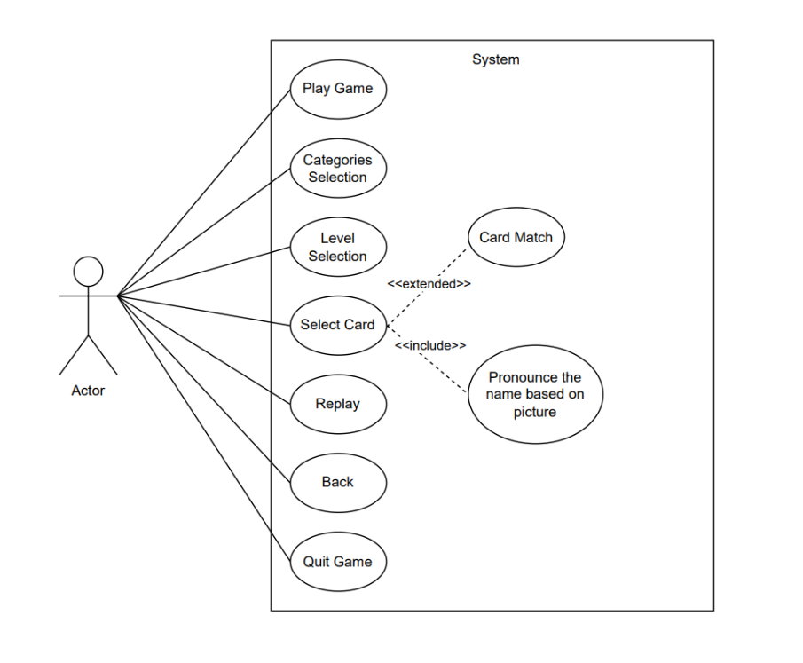

Project: FunFlip Game

Authors:

Ashish Ghaskata\
Krishna Raj Bhandri

Suraj Bhatta

Mohammad Adnan Khan

**Document name:** AB-Funflip Game-RequirementDoc

**Creation date:** 20.06.2025

# Table of Contents {#table-of-contents .TOC-Heading .unnumbered}

[1 Product Vision and Project Goal
[2](#product-vision-and-project-goal)](#product-vision-and-project-goal)

[Vision Statement (Golden Circle Framework)
[2](#vision-statement-golden-circle-framework)](#vision-statement-golden-circle-framework)

[Personas [3](#personas)](#personas)

[**User stories** [4](#user-stories)](#user-stories)

[Use Cases [5](#use-cases)](#use-cases)

[Usecase Diagram: [5](#usecase-diagram)](#usecase-diagram)

[Activity Diagram: [6](#activity-diagram)](#activity-diagram)

[Use case and Description:
[7](#use-case-and-description)](#use-case-and-description)

[Context Analysis [13](#context-analysis)](#context-analysis)

[1. Quantity Structure [13](#quantity-structure)](#quantity-structure)

[2. Dictionary of Terms
[13](#dictionary-of-terms)](#dictionary-of-terms)

Table of Figure

[Figure 1 Use Case Diagram [5](#_Toc201630366)](#_Toc201630366)

#  {#section .unnumbered}

# Product Vision and Project Goal

## 1.1 Vision Statement (Golden Circle Framework) {#vision-statement-golden-circle-framework .unnumbered}

Why?

-   Make early learning joyful & stress-free

-   Build confidence & curiosity through play

How?

-   No-pressure memory game with:

```{=html}
<!-- -->
```
-   Cheerful feedback (no penalties)

-   Audio-visual vocabulary reinforcement

-   Adaptive difficulty levels

What?

-   A card-matching game for ages 4-6

-   Teaches animals, fruits & vegetables

SMART Goals

-   Specific: Improve memory/vocabulary via audio-visual card matching

-   Measurable: 80% of kids learn 10+ new words after 3 sessions

-   Achievable: Launch MVP with 3 categories & 3 difficulty levels

-   Relevant: Aligns with early childhood education standards

-   Time-bound: Prototype in 3 months, full launch in 6 months

Key Goal:\
\*\"Launch on iOS/Android in 6 months with 70% of testers showing
improved word retention.\"\*

# Personas

{width="6.332607174103237in"
height="3.4910520559930007in"}

{width="6.5in"
height="3.591666666666667in"}

# User stories

**1.  Navigation & Accessibility**

-   **As a child**, I want a simple and colorful start screen so I can
    begin playing quickly.

-   **As a child**, I want to choose a learning category (e.g., Animals,
    Fruits, Vegetables) so I can explore different themes.

-   **As a child**, I want to pick my difficulty level (Easy, Medium,
    Hard) so I can play at a comfortable challenge.

-   **As a child**, I want a clearly labeled back button so I can return
    to the previous screen if I change my mind.

**2.  Gameplay Mechanics**

-   **As a child**, I want to tap on cards to flip them and reveal
    images so I can find matching pairs.

-   **As a child**, I want unmatched cards to flip back automatically
    after a short delay so I can keep trying.

-   **As a child**, I want my total number of turns to be displayed so I
    can see how many tries I used.

-   **As a child**, I want smooth and fun animations when flipping cards
    so the game feels exciting.

**3.  Rewards & Progression**

-   **As a child**, I want to see a trophy or a star when I complete a
    level so I feel rewarded.

-   **As a child**, I want the game to offer a button to replay the
    level or go back to the home menu after I win.

-   **As a child**, I want a big celebration (confetti, cheering sounds,
    or a special badge) when I finish all levels in a category.

**4.  Learning & Feedback**

-   **As a child**, I want to hear the name of the image when I flip a
    card so I can learn new words.

-   **As a child**, I want a happy sound effect when I match a pair
    correctly so I feel encouraged.

-   **As a child**, I want different voice feedback for each category
    (e.g., animal sounds for Animals, voice saying names for Fruits) so
    learning feels engaging.

-   **As a child**, I want the voice to sound friendly and fun so I stay
    interested.

# Use Cases

1.  Start Screen Navigation

2.  Learning Categories Selection 

3.  Level Selection

4.  Returning to level Selection

5.  Card Matching Gameplay 

6.  Level Replay 

## {width="6.35in" height="5.243055555555555in"}4.1 Usecase Diagram:  {#usecase-diagram .unnumbered}

[]{#_Toc201630366 .anchor}Figure 1 Use Case Diagram**\
\
**

## 4.2 Activity Diagram: {#activity-diagram .unnumbered}

{width="4.833333333333333in"
height="7.21875in"}

# 4.3 Use case and Description: {#use-case-and-description .unnumbered}

 

+--------------+-------------------------------------------------------+
| Use case     | Description                                           |
+==============+=======================================================+
| Name         | Start Screen Navigation                               |
+--------------+-------------------------------------------------------+
| Short        | It describes the process of launching the game and    |
| Description  | reaching the category selection screen                |
+--------------+-------------------------------------------------------+
| Actors       | 1.  Child                                             |
|              |                                                       |
|              | 2.  Game System                                       |
+--------------+-------------------------------------------------------+
| P            | The Game is installed and running on a device         |
| re-Condition |                                                       |
+--------------+-------------------------------------------------------+
| Trigger      | The child wants to start playing the game             |
+--------------+-------------------------------------------------------+
| Main         | 1.  The child opens the game application              |
| Scenario     |                                                       |
|              | 2.  The system displays the start screen with a "Play |
|              |     Game" and "Quit Game" button.                     |
|              |                                                       |
|              | 3.  The child clicks the "Play Game" button           |
|              |                                                       |
|              | 4.  The system loads the learning category selection  |
|              |     screen                                            |
|              |                                                       |
|              | 5.  The child sees different learning categories and  |
|              |     can choose one                                    |
|              |                                                       |
|              | 6.  The child clicks the "Quite Game" button          |
|              |                                                       |
|              | 7.  The game will stop and come out from game         |
|              |     interface                                         |
|              |                                                       |
|              | 8.  Use case completed                                |
+--------------+-------------------------------------------------------+
| Alternative  | 1.  The child does not press the "Play Game" Button.  |
| Scenarios    |                                                       |
|              | a\. The system remains idle on the start screen       |
|              |                                                       |
|              | b\. Continue to the category page when child          |
|              | interacts.                                            |
|              |                                                       |
|              |                                                       |
|              |                                                       |
|              |       2. The child does not press the "Quit Game"     |
|              | Button                                                |
|              |                                                       |
|              | a.  The System remains idle on the start screen       |
+--------------+-------------------------------------------------------+
| Special      | 1.  The device enters sleep mode while idle on start  |
| Cases        |     screen                                            |
|              |                                                       |
|              |     -   App remains paused, resumes without restart.  |
+--------------+-------------------------------------------------------+
| Post -       | **Main Scenario:** The game reaches the learning      |
| conditions   | category selection screen.                            |
|              |                                                       |
|              | **Alternative Scenario :** The game remains at  the   |
|              | start screen until the child presses the "Play Game"  |
|              | button.                                               |
+--------------+-------------------------------------------------------+

 

+------------+---------------------------------------------------------+
| **Use      | **Description**                                         |
| case**     |                                                         |
+============+=========================================================+
| Name       | Learning Category Selection                             |
+------------+---------------------------------------------------------+
| Short      | It describes how the child selects a learning category  |
| De         | to explore different themes in the game                 |
| scription  |                                                         |
+------------+---------------------------------------------------------+
| Actors     | 1.  Child                                               |
|            |                                                         |
|            | 2.  Game System                                         |
+------------+---------------------------------------------------------+
| Pre        | 1.  The child has successfully navigated past the start |
| -Condition |     screen                                              |
|            |                                                         |
|            | 2.  The game displays the learning category selection   |
|            |     screen                                              |
+------------+---------------------------------------------------------+
| Trigger    | The child wants to explore a specific category before   |
|            | playing                                                 |
+------------+---------------------------------------------------------+
| Main       | 1.  The system presents multiple learning categories    |
| Scenario   |     like Tiere, Obst and Gemüse                         |
|            |                                                         |
|            | 2.  The child views the available categories            |
|            |                                                         |
|            | 3.  The child clicks on a desired category              |
|            |                                                         |
|            | 4.  The system loads the selected category              |
|            |                                                         |
|            | 5.  The child sees the levels related to the chosen     |
|            |     category                                            |
|            |                                                         |
|            | 6.  Use case completed                                  |
+------------+---------------------------------------------------------+
| A          | 1.  The child does not select a category                |
| lternative |                                                         |
| Scenarios  | a\. The system remains idle at the category selection   |
|            | screen.                                                 |
|            |                                                         |
|            | b\. The child can return later and make a selection     |
+------------+---------------------------------------------------------+
| Special    | 1.  Child attempts to tap multiple categories quickly   |
| Cases      |                                                         |
|            |     -   System only accepts the first valid input,      |
|            |         > ignores multiple taps                         |
+------------+---------------------------------------------------------+
| Post -     | **Main Scenario:** The selected learning category is    |
| conditions | successfully loaded. **Alternative Scenario :** The     |
|            | game stays at the category selection screen until the   |
|            | child picks a category.                                 |
+------------+---------------------------------------------------------+

 

+--------------+-------------------------------------------------------+
| **Use case** | **Description**                                       |
+==============+=======================================================+
| Name         | Level Selection                                       |
+--------------+-------------------------------------------------------+
| Short        | In this use case describes how the child selects a    |
| Description  | level to play at the preferred difficulty.            |
+--------------+-------------------------------------------------------+
| Actors       | 1.  Child                                             |
|              |                                                       |
|              | 2.  Game System                                       |
+--------------+-------------------------------------------------------+
| P            | 1.  The child has successfully chosen a learning      |
| re-Condition |     category                                          |
|              |                                                       |
|              | 2.  The game displays the level selection screen.     |
+--------------+-------------------------------------------------------+
| Trigger      | The child wants to select a level before starting the |
|              | game.                                                 |
+--------------+-------------------------------------------------------+
| Main         | 1.  The system presents multiple levels like Easy -   |
| Scenario     |     level 1 3x4,\                                     |
|              |     Medium - Level 2 4x5, Hard  - Level 3, 5x6        |
|              |                                                       |
|              | 2.  The child views the available levels.             |
|              |                                                       |
|              | 3.  The child selects a desired level                 |
|              |                                                       |
|              | 4.  The system loads the selected level               |
|              |                                                       |
|              | 5.  The child sees the game board with matching       |
|              |     cards                                             |
|              |                                                       |
|              | 6.  Use case completed                                |
+--------------+-------------------------------------------------------+
| Alternative  | 1.  The child does  not select a level                |
| Scenarios    |                                                       |
|              | a.The system remains idle at the level selection      |
|              | screen                                                |
|              |                                                       |
|              | b.The child can return later and make a selection     |
+--------------+-------------------------------------------------------+
| Special      | 1.  Child tries to select a level rapidly multiple    |
| cases        |     times                                             |
|              |                                                       |
|              |     -   Debounce to avoid multiple load attempts      |
+--------------+-------------------------------------------------------+
| Post -       | **Main Scenario:** The selected level is successfully |
| conditions   | loaded and ready to play.                             |
|              |                                                       |
|              | **Alternative Scenario :** The game stays at the      |
|              | level selection screen until the child picks a level. |
+--------------+-------------------------------------------------------+

+------------+---------------------------------------------------------+
| **Use      | **Description**                                         |
| case**     |                                                         |
+============+=========================================================+
| Name       | Back Button for navigation                              |
+------------+---------------------------------------------------------+
| Short      | It describes how the child can use a back button to     |
| De         | return to the previous screen, allowing them to modify  |
| scription  | their selection or choose a different level.            |
+------------+---------------------------------------------------------+
| Actors     | 1.  Child                                               |
|            |                                                         |
|            | 2.  Game System                                         |
+------------+---------------------------------------------------------+
| Pre        | 1.  The child has navigated to a specific page like go  |
| -Condition |     to home page, level selection, category selection.  |
+------------+---------------------------------------------------------+
| Trigger    | The child wants to go back to the previous screen to    |
|            | change their choice.                                    |
+------------+---------------------------------------------------------+
| Main       | 1.  The child is currently on a screen e.g. level       |
| Scenario   |     selection                                           |
|            |                                                         |
|            | 2.  The system displays a "Back" button on the          |
|            |     interface                                           |
|            |                                                         |
|            | 3.  The child clicks the "Back" button                  |
|            |                                                         |
|            | 4.  The system returns the child to the previous screen |
|            |     e.g. level selection → categories selection page    |
|            |                                                         |
|            | 5.  The child sees their previous choices and can       |
|            |     modify them                                         |
|            |                                                         |
|            | 6.  The child selects a new option e.g. different       |
|            |     category or level                                   |
|            |                                                         |
|            | 7.  The system loads the updated selection              |
|            |                                                         |
|            | 8.  Use case completed                                  |
+------------+---------------------------------------------------------+
| A          | 1.  The child does not press the "Back" button          |
| lternative |                                                         |
| Scenarios  | a\. The system remains on the current screen            |
|            |                                                         |
|            | b\. The child can continue selecting options or exit    |
|            | the game.                                               |
+------------+---------------------------------------------------------+
| Special    | 1.  Child taps back multiple times quickly              |
| cases      |                                                         |
|            |     -   System processes one back action at a time to   |
|            |         > prevent unintended exits.                     |
+------------+---------------------------------------------------------+
| Post -     | **Main Scenario:** The child successfully navigates     |
| conditions | back and can modify their selection.                    |
|            |                                                         |
|            | **Alternative Scenario :** The game remains on the same |
|            | screen until the child decides to navigate back.        |
+------------+---------------------------------------------------------+

+---------------+------------------------------------------------------+
| **Use case**  | **Description**                                      |
+===============+======================================================+
| Name          | Card Matching Gameplay                               |
+---------------+------------------------------------------------------+
| Short         | This use case describes how the child flips cards to |
| Description   | reveal images and find matching pairs                |
+---------------+------------------------------------------------------+
| Actors        | 1.  Child                                            |
|               |                                                      |
|               | 2.  Game System                                      |
+---------------+------------------------------------------------------+
| Pre-Condition | 1.  The child has successfully selected a level      |
|               |                                                      |
|               | 2.  The game displays a board with face-down cards   |
+---------------+------------------------------------------------------+
| Trigger       | The child wants to start finding matching pairs      |
+---------------+------------------------------------------------------+
| Main Scenario | 1.  The child clicks on a card to flip it            |
|               |                                                      |
|               | 2.  The system reveals the image on the card         |
|               |                                                      |
|               | 3.  The child clicks another card to flip it         |
|               |                                                      |
|               | 4.  The system reveals the second image              |
|               |                                                      |
|               | 5.  The system checks if the two images match        |
|               |                                                      |
|               | If they match :                                      |
|               |                                                      |
|               | a.The cards remain flipped                           |
|               |                                                      |
|               | b.The system plays a confirmation sound              |
|               |                                                      |
|               | c.The child score will increase by 1                 |
|               |                                                      |
|               | If they do not match:                                |
|               |                                                      |
|               | a.the cards will flip back                           |
|               |                                                      |
|               | b.The child continues searching                      |
|               |                                                      |
|               | 6.    The process repeats until all pairs are found. |
|               |                                                      |
|               | 7.    The system confirms level completion and       |
|               | displays a reward                                    |
|               |                                                      |
|               | 8.    Use case completed                             |
+---------------+------------------------------------------------------+
| Alternative   | 1.  The child does not flip any cards                |
| Scenarios     |                                                      |
|               | > a.The system remains idle, waiting for user input  |
|               | >                                                    |
|               | > b\. The child can start playing at any time        |
+---------------+------------------------------------------------------+
| Special Cases | 1.  Child flips the same card twice                  |
|               |                                                      |
|               |     -   System ignores the second tap on the same    |
|               |         > card until another card is selected.       |
+---------------+------------------------------------------------------+
| Post -        | **Main Scenario:** The child successfully finds all  |
| conditions    | matching pairs and completes the level               |
|               |                                                      |
|               | **Alternative Scenario:** The child can take their   |
|               | time or exit without finishing.                      |
+---------------+------------------------------------------------------+

 

+-------------+--------------------------------------------------------+
| **Use       | **Description**                                        |
| case**      |                                                        |
+=============+========================================================+
| Name        | Level Replay                                           |
+-------------+--------------------------------------------------------+
| Short       | This use case describes how the child can choose to    |
| D           | replay a completed level to improve their score or     |
| escription  | practice more                                          |
+-------------+--------------------------------------------------------+
| Actors      | 1.  Child                                              |
|             |                                                        |
|             | 2.  Game System                                        |
+-------------+--------------------------------------------------------+
| Pr          | 1.  The child has completed a level                    |
| e-Condition |                                                        |
|             | 2.  The system has displayed the level completion      |
|             |     screen                                             |
+-------------+--------------------------------------------------------+
| Trigger     | The child wants to replay the same level instead of    |
|             | moving forward                                         |
+-------------+--------------------------------------------------------+
| Main        | 1.  The child reaches the level completion screen      |
| Scenario    |                                                        |
|             | 2.  The system displays options:                       |
|             |                                                        |
|             | -   Move to the next level                             |
|             |                                                        |
|             | -   Replay the same level                              |
|             |                                                        |
|             | -   Go to the Main Menu                                |
|             |                                                        |
|             | > 3\. The child clicks the "Replay Level" button       |
|             | >                                                      |
|             | > 4\. The system reloads the level with shuffled card  |
|             | > positions                                            |
|             | >                                                      |
|             | > 5\.  The child begins playing the level again        |
|             | >                                                      |
|             | > 6\.  The system tracks the new score separately      |
|             | >                                                      |
|             | > 7\.  Use case completed                              |
+-------------+--------------------------------------------------------+
| Alternative | a.  The child does not select the replay option        |
| Scenarios   |                                                        |
|             | ```{=html}                                             |
|             | <!-- -->                                               |
|             | ```                                                    |
|             | 1.  The system remains on the level completion screen  |
|             |                                                        |
|             | 2.  The child can choose another option later          |
+-------------+--------------------------------------------------------+
| Special     | 1.  Child repeatedly taps replay button.               |
| Cases       |                                                        |
|             |     -   System allows only one replay action, prevents |
|             |         > multiple reloads                             |
+-------------+--------------------------------------------------------+
| Post -      | **Main Scenario:** The child successfully restarts the |
| conditions  | level and attempts to improve their score              |
|             |                                                        |
|             | **Alternative Scenario:** The game remains at the      |
|             | level completion screen until the child chooses        |
|             | another action.                                        |
+-------------+--------------------------------------------------------+

# Context Analysis 

## Quantity Structure

**\
**Understanding the size and scope of your project helps estimate time,
resources, testing requirements, and scalability. It prevents under- or
over-engineering.

** **

** **

**Key Size Indicators for *Fun Flips*:**

  -----------------------------------------------------------------------
  **Component**    **Quantity / Range**
  ---------------- ------------------------------------------------------
  **Categories**   3 (Animals, Fruits, Vegetables)

  **Levels per     3 (Easy, Medium, Hard)
  Category**       

  **Cards per      6 pairs (Easy), 9 pairs (Medium), 12 pairs (Hard)
  Level**          

  **Total Unique   \~ (36 across all difficulties)
  Cards**          

  **Voice Files**  1 per unique card image (\~36)

  **Animations**   At least 3 types (Flip animation, Match celebration,
                   Trophy)

  **Game States**  \~5 (Start, Category Selection, Level Selection,
                   Gameplay, Completion & Replay/Exit)

  **Sound          \~4 (Card flip, Match, Level complete, Wrong match
  Effects**        pause)
  -----------------------------------------------------------------------

## Dictionary of Terms

  ---------------------------------------------------------------------------
  **Term**            **Definition**
  ------------------- -------------------------------------------------------
  **Player/Child**    The end-user (kid aged 4--6) interacting with the game,
                      flipping cards and progressing through levels.

  **Card**            An interactive game element with an image and audio
                      pronunciation. Cards are paired for matching.

  **Card Flip**       An action performed by the player to reveal a card's
                      content (image and sound).

  **Match**           A successful pairing of two identical cards. Triggers
                      positive feedback.

  **Category**        A learning theme (e.g., Animals, Fruits, Vegetables)
                      containing levels and cards.

  **Level**           A predefined game stage with a specific number of cards
                      and difficulty (Easy, Medium, Hard).

  **Game**            A complete session initiated by the player, consisting
                      of rounds, levels, and interactions.

  **Round**           A play-through of one level by the player. A game may
                      include several rounds.

  **Turn**            A numerical value representing the number of turn
                      pairs.

  **Visual Feedback** Animations or effects (like stars, clapping) shown
                      after correct matches or level completion.

  **Audio Feedback**  Voice pronunciation of cards and sound effects for
                      correct matches or actions.

  **Trophy/Reward**   A motivational visual (e.g., trophy animation)
                      displayed after level or game completion.

  **Back Button**     UI control that allows the child to return to a
                      previous screen (e.g., from level to category
                      selection).

  **Start Screen**    The first screen seen by the player with options to
                      play or quit the game.

  **Completion        A summary screen shown at the end of a level offering
  Screen**            options to replay, proceed, or exit.
  ---------------------------------------------------------------------------

** **
